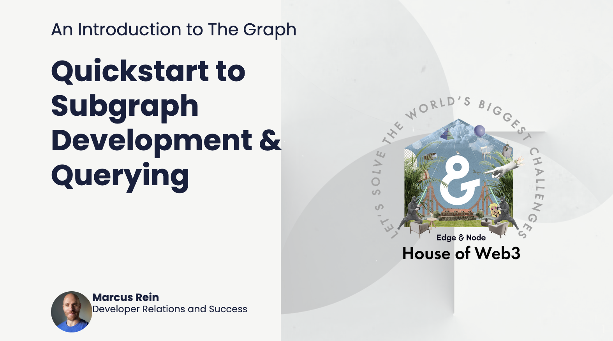
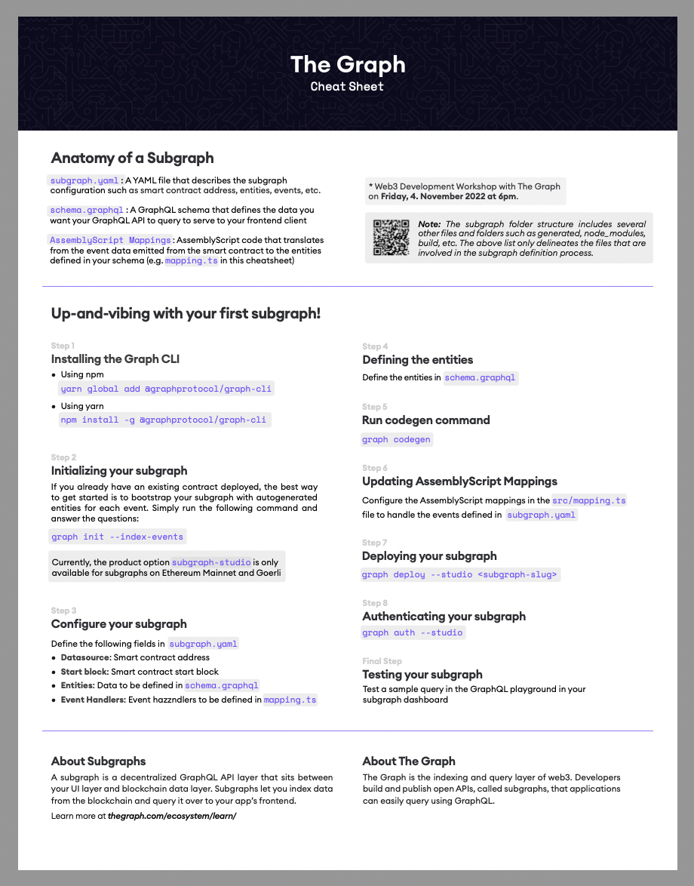
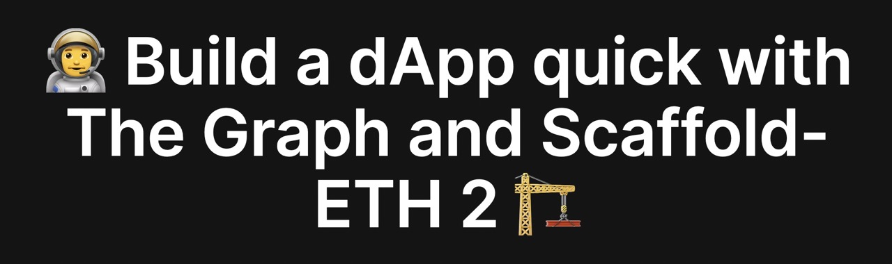

# Subgraph Development and Querying Workshop

## [ Workshop Slides ](https://docs.google.com/presentation/d/1MMgXx_GrufU_o0JdFhEmqpxRKAFyMAxSdYyGO-9kfnU/edit?usp=sharing)

[](https://docs.google.com/presentation/d/1-jZd4Sp83YW6r2KhXYeU4sOlKdcmp0LVi3WF1VAkxzk/edit?usp=sharing)

Open These Tabs to Code Along with Live Workshop:

-   [Subgraph Studio](https://www.thegraph.com/studio)
-   Cryptopunks contract address ([Etherscan](https://etherscan.io/address/0xb47e3cd837ddf8e4c57f05d70ab865de6e193bbb))
    0xb47e3cd837ddf8e4c57f05d70ab865de6e193bbb
-   [Miniscan.xyz](https://miniscan.xyz/)
-   [Jerry Okolo's Published CryptoPunks Subgraph](https://thegraph.com/explorer/subgraphs/YqMJatbgbqy1GodtbYZv4U9NzyaScCgSF7CAE5ivAM7?view=Overview&chain=mainnet)
    -   This subgraph's [repo](https://github.com/itsjerryokolo/CryptoPunks)
    -   This subgraph's [schema.graphql](https://github.com/itsjerryokolo/CryptoPunks/blob/main/schema.graphql)

## Cheatsheet

[](./cheatsheet_Design_ETH_SF.pdf)

## Prerequisites

-   Install graph-cli: `yarn global add @graphprotocol/graph-cli`

# Learning Environment 1 :

## Compare a Starter Subgraph with a Published Cryptopunks Subgraph Thats Live on The Graph Network

### Deploy a Starter Subgraph

#### 1. Gather information

Use [Miniscan](https://startblock.vercel.app/) to find important information relevant to your subgraph (smart contract name, ABI, startblock).

-   Cryptopunks contract on [Etherscan](https://etherscan.io/address/0xb47e3cd837ddf8e4c57f05d70ab865de6e193bbb): 0xb47e3cd837ddf8e4c57f05d70ab865de6e193bbb

#### 2. Go to [Subgraph Studio](https://thegraph.com/studio/), and create a new subgraph

-   Follow the instructions in Subgraph Studio to spin up a new subgraph on your local computer using `graph-cli`.

-   Enter information gathered from Miniscan into `graph-cli` as prompted.

-   Choose "yes" when asked if wanting to index events as entites.
-   `graph deploy`... to deploy your subgraph

## Review Key Files in your Starter Cryptopunks Subgraph.

-   subgraph.yaml (Subgraph Manifest)
-   src/mappings.ts (Subgraph Logic)
-   schema.graphql (Presented Subgraph Data)

## Compare Starter Subgraph's Key Files to Published Cryptopunks Subgraph Key Files

-   [Jerry Okolo's Published Cryptopunks Subgraph](https://thegraph.com/explorer/subgraphs/YqMJatbgbqy1GodtbYZv4U9NzyaScCgSF7CAE5ivAM7?view=Overview&chain=mainnet) published on The Graph Network.

-   https://github.com/itsjerryokolo/CryptoPunks
-   See what strategies Jerry uses in his subgraph and if you'd like to incorporate his strategies into your subgraph.
-   An an exercise, try answering these questions with Jerry's Cryptopunks subgraph and your Cryptopunks subgraph with well-designed queries in the subgraph Playground.

```
- What are the first 10 transfers in Cryptopunks history
- Find the total value in Eth sales all punks, the total supply, and the total number of sales?
- 10 highest value Cryptopunks transactions of all time?
- How much ETH sales in total?
- Does Vitalik have a Cryptopunk?
- How many Cryptopunks wear a Pilot Helmet?
- What account has made the most transactions ever?
- Provenance (Who owned it before? Is it really the right one?)
- If available (only on-chain market places), what is the current asking price?
- What’s the highest current bid?
- Number of transfers made in the first block of Cryptopunks deployment?

```

## Next steps:

1. Try building with Kevin Jones' [blog](https://mirror.xyz/cryptomastery.eth/uGHEHnskoVwX-mWjAiidXfGt6QowCoKl_yX4okwZc0E) that combines ScaffoldETH-2 and Subgraphs

[](https://mirror.xyz/cryptomastery.eth/uGHEHnskoVwX-mWjAiidXfGt6QowCoKl_yX4okwZc0E)

2. Try out Learning Environment 2

# Learning Environment 2:

## Deploy a Starter Subgraph and Extend an Entity

#### 1. Gather information

Use [Miniscan](https://startblock.vercel.app/) to find important information relevant to your subgraph (smart contract name, ABI, startblock).

-   Cryptopunks contract on [Etherscan](https://etherscan.io/address/0xb47e3cd837ddf8e4c57f05d70ab865de6e193bbb)

#### 2. Go to [Subgraph Studio](https://thegraph.com/studio/), and create a new subgraph

-   Follow the instructions in Subgraph Studio to spin up a new subgraph on your local computer using `graph-cli`.

-   Enter information gathered from MiniScan into `graph-cli` as prompted.

-   Choose "yes" when asked if wanting to index events as entites.
-   `graph deploy`... to deploy your subgraph

#### Review key files in your starter Cryptopunks subgraph.

-   subgraph.yaml (Subgraph Manifest)
-   src/mappings.ts (Subgraph Logic)
-   schema.graphql (Presented Subgraph Data)

### Understand the Generated Transfer Entity in Schema.graphql

```graphql
# schema.graphql
type Transfer @entity(immutable: true) {
	id: Bytes!
	from: Bytes! # address
	to: Bytes! # address
	value: BigInt! # uint256
	blockNumber: BigInt!
	blockTimestamp: BigInt!
	transactionHash: Bytes!
}
```

#### Extend the `Transfer` Entity

Lets create a property in the `Transfer` entity that records the gas price of the transfer.

Add `gasPrice` to `Transfer` entity:

```graphql
# schema.graphql
type Transfer @entity(immutable: true) {
	id: Bytes!
	from: Bytes! # address
	to: Bytes! # address
	value: BigInt! # uint256
	blockNumber: BigInt!
	blockTimestamp: BigInt!
	transactionHash: Bytes!
	gasPrice: BigInt! ## ADDED HERE
}
```

#### Update mappings.ts to send event data to the `gasPrice` property on the Transfer entity

```typescript
// mappings.ts
export function handleTransfer(event: TransferEvent): void {
	let entity = new Transfer(
		event.transaction.hash.concatI32(event.logIndex.toI32())
	);
	entity.from = event.params.from;
	entity.to = event.params.to;
	entity.value = event.params.value;

	entity.blockNumber = event.block.number;
	entity.blockTimestamp = event.block.timestamp;
	entity.transactionHash = event.transaction.hash;

	entity.gasPrice = event.transaction.gasPrice;

	entity.save();
}
```

### Add a new entity to store Account information

This new `gasSpent` property will total gas spent by an `Account`.

```graphql
# schema.graphql
type Transfer @entity(immutable: true) {
	id: Bytes!
	from: Bytes! # address
	to: Bytes! # address
	value: BigInt! # uint256
	blockNumber: BigInt!
	blockTimestamp: BigInt!
	transactionHash: Bytes!
	gasPrice: BigInt!
}
type Account @entity {
	id: Bytes! # address
	gasSpent: BigInt! # uint256
}
```

### Update mappings.ts to populate new `Account` entity

You must import `BigInt` from the `graph-ts` typscript helper library to perform the `plus()` function described below.

```typescript
// src/mappings.ts
import { BigInt } from "@graphprotocol/graph-ts";
```

Read more about the [graph-ts](https://github.com/graphprotocol/graph-tooling/tree/main/packages/ts) helper library.

```typescript
// mappings.ts
export function handleTransfer(event: TransferEvent): void {
	let entity = new Transfer(
		event.transaction.hash.concatI32(event.logIndex.toI32())
	);
	entity.from = event.params.from;
	entity.to = event.params.to;
	entity.value = event.params.value;

	entity.blockNumber = event.block.number;
	entity.blockTimestamp = event.block.timestamp;
	entity.transactionHash = event.transaction.hash;
	entity.gasPrice = event.transaction.gasPrice;

	entity.save();

	// Load account from store. If account does not exist, create an account and set the gasSpent to 0.

	let account = Account.load(
		event.transaction.hash.concatI32(event.block.hash.toI32())
	);
	if (account == null) {
		account = new Account(
			event.transaction.hash.concatI32(event.block.hash.toI32())
		);
		account.gasSpent = BigInt.fromI32(0);
	}

	// Add the gas price of the current transaction to the total gas spent
	account.gasSpent = account.gasSpent.plus(event.transaction.gasPrice);

	account.save();
}
```

### Next Steps:

-   Add more entities and mappings logic as desired.

-   Build queries using the Playground Explorer and reference the [The Graph GraphQL docs](https://thegraph.com/docs/en/querying/graphql-api/) to improve query accuracy.

-   Try building with Kevin Jones' [blog](https://mirror.xyz/cryptomastery.eth/uGHEHnskoVwX-mWjAiidXfGt6QowCoKl_yX4okwZc0E) that combines ScaffoldETH-2 and Subgraphs

[](https://mirror.xyz/cryptomastery.eth/uGHEHnskoVwX-mWjAiidXfGt6QowCoKl_yX4okwZc0E)

---

Happy hacking,

Marcus Rein

Developer Relations and Developer Success

Edge & Node

https://www.twitter.com/Marcus_Rein_

---

## Other example subgraphs:

-   [Messari Subgraphs](https://subgraphs.messari.io)
-   [EIP-721 (NFTS on The Graph Network)](https://thegraph.com/explorer/subgraph?id=AVZ1dGwmRGKsbDAbwvxNmXzeEkD48voB3LfGqj5w7FUS&view=Overview)
-   [Lens Protocol](https://thegraph.com/hosted-service/subgraph/anudit/lens-protocol)
-   [Unlock Protocol on The Graph Network](https://thegraph.com/explorer/subgraph?id=8u7KcVRxjtTDRgEJup3UuPJk6YoRDTHNpSMk5BEpdw42&view=Overview)
-   [Open Sea Subgraph](https://thegraph.com/hosted-service/subgraph/protofire/opensea-wyvern-exchange-subgraph)
-   [LiNEAR](https://thegraph.com/hosted-service/subgraph/linear-protocol/linear)
-   [Aave Gotchi](https://thegraph.com/hosted-service/subgraph/aavegotchi/aavegotchi-core-matic)
-   [Tellor](https://thegraph.com/hosted-service/subgraph/tellor-io/tellorxoraclemainhgraph)
-   [Live Peer](https://thegraph.com/hosted-service/subgraph/livepeer/arbitrum-one)
-   [ENS](https://thegraph.com/hosted-service/subgraph/ensdomains/ens)
-   [UMA on The Graph Network](https://thegraph.com/explorer/subgraph?id=41LCrgtCNBQyDiVVyZEuPxbvkBH9BxxLU3nEZst77V8o&view=Overview)

#### Other resources

-   https://github.com/schmidsi/hackathon-starterkit
-   https://github.com/scaffold-eth/scaffold-eth#-scaffold-eth
-   https://github.com/Developer-DAO/resources
-   https://dev.to/dabit3/the-complete-guide-to-full-stack-ethereum-development-3j13
-   https://github.com/itsjerryokolo/CryptoPunks
-   https://github.com/dabit3/building-a-subgraph-workshop
-   https://thegraph.com/docs/developer/quick-start
-   https://thegraph.com/discord
-   https://protean-labs.github.io/subgrounds/
